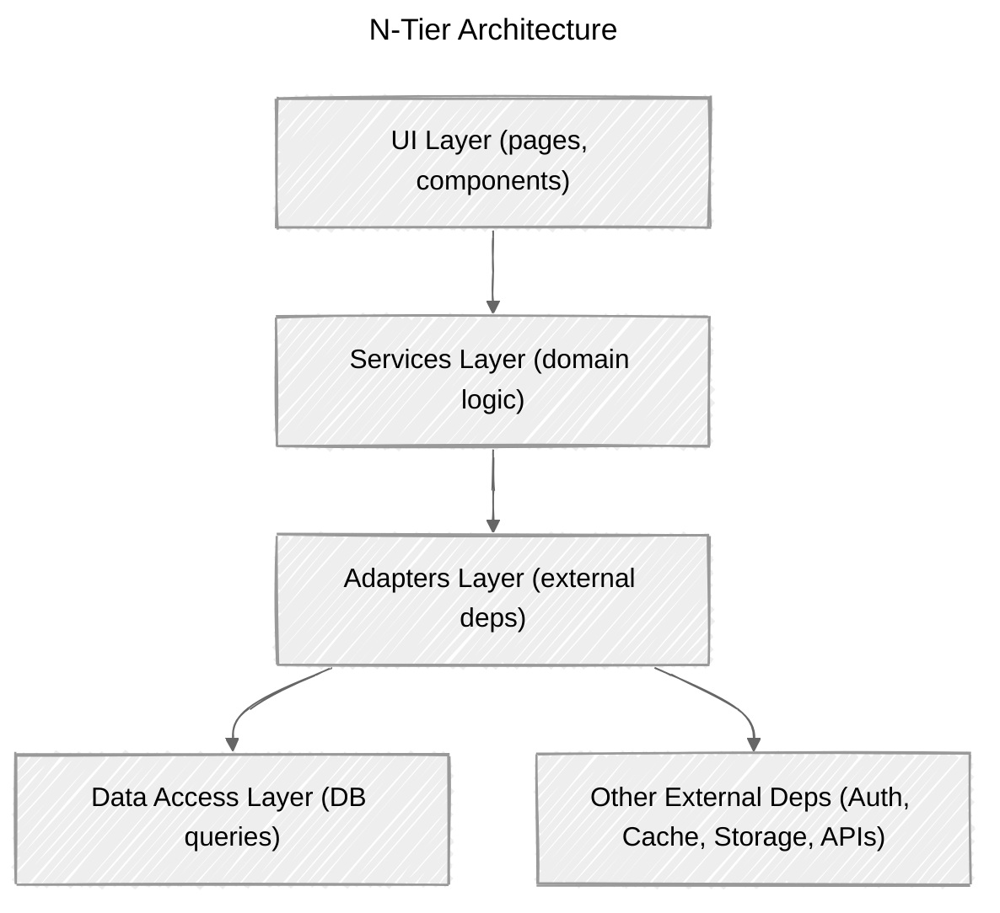

```mermaid
---
title: N-Tier Architecture 
config:
  theme: neutral
  look: handDrawn
---

flowchart TD

UI["UI Layer (pages, components)"] --> Services

Services["Services Layer (domain logic)"] --> Adapters

Adapters["Adapters Layer (external deps)"] --> DAL

DAL["Data Access Layer (DB queries)"]

Adapters --> OtherDeps["Other External Deps (Auth, Cache, Storage, APIs)"]
```
