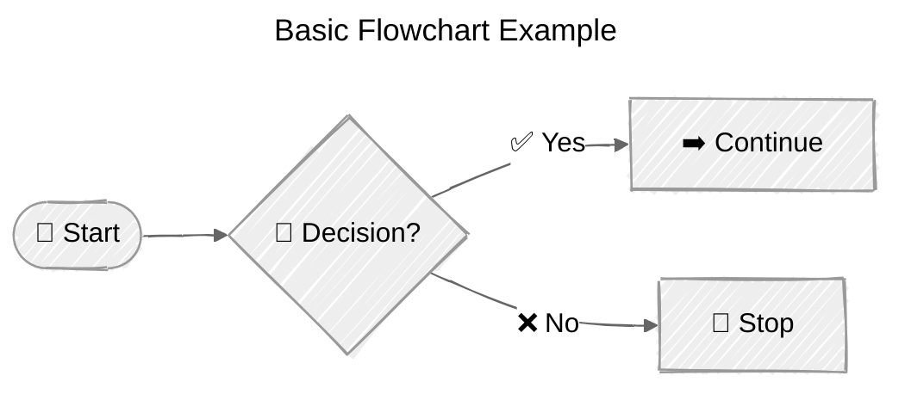

```mermaid
---
title: Basic Flowchart Example
config:
  theme: neutral
  look: handDrawn
---
flowchart LR

a([🚀 Start]) --> b{🤔 Decision?}

b -- ✅ Yes --> c[➡️ Continue]

b -- ❌ No --> d[🛑 Stop]
```
