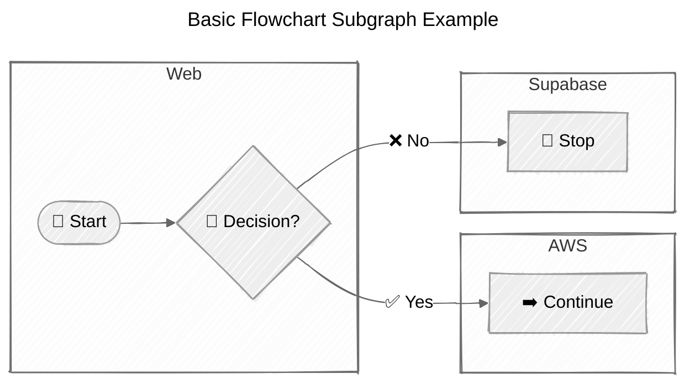

```mermaid
---
title: Basic Flowchart Subgraph Example
config:
  theme: neutral
  look: handDrawn
---
flowchart LR

subgraph Web
a([🚀 Start]) --> b{🤔 Decision?}
end

subgraph AWS
b -- ✅ Yes --> c[➡️ Continue]
end

subgraph Supabase
b -- ❌ No --> d[🛑 Stop]
end
```
