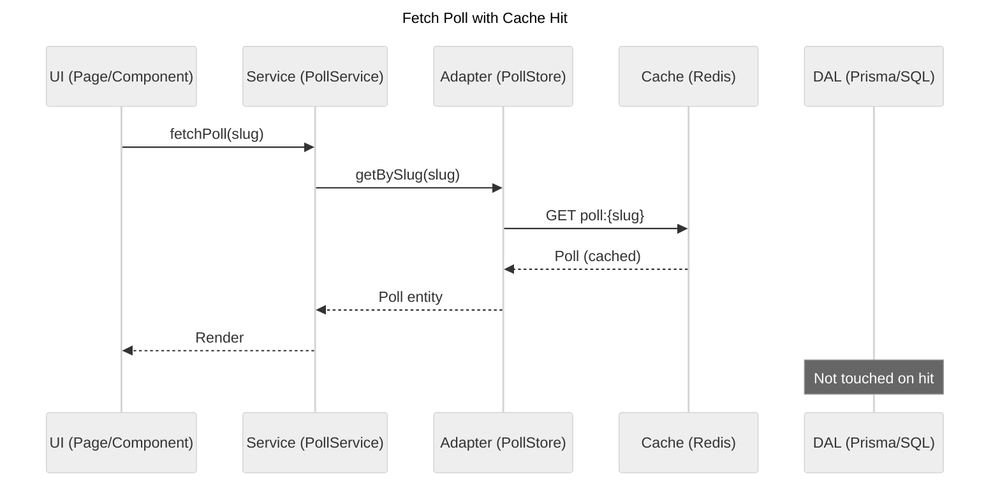
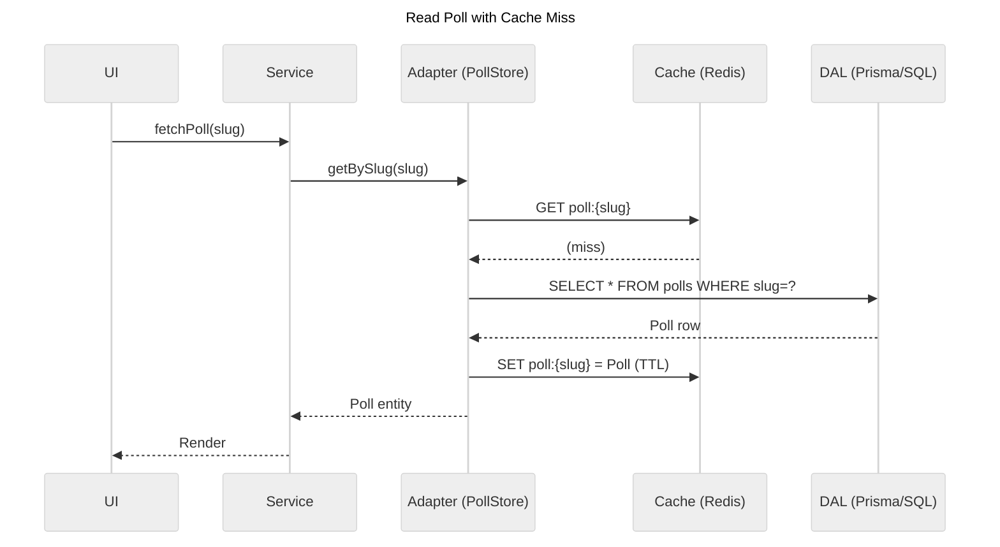
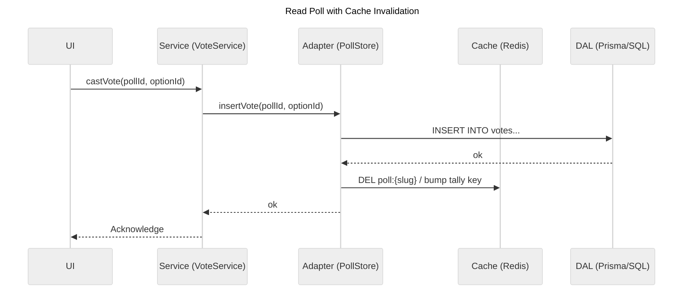

```mermaid
---
title: Fetch Poll with Cache Hit
config:
  theme: neutral
---
sequenceDiagram
    participant UI as UI (Page/Component)
    participant S as Service (PollService)
    participant PS as Adapter (PollStore)
    participant C as Cache (Redis)
    participant DB as DAL (Prisma/SQL)

    UI->>S: fetchPoll(slug)
    S->>PS: getBySlug(slug)
    PS->>C: GET poll:{slug}
    C-->>PS: Poll (cached)
    PS-->>S: Poll entity
    S-->>UI: Render
    note over DB: Not touched on hit

```

```mermaid
---
title: Read Poll with Cache Miss
config:
  theme: neutral
---

sequenceDiagram
    participant UI as UI
    participant S as Service
    participant PS as Adapter (PollStore)
    participant C as Cache (Redis)
    participant DB as DAL (Prisma/SQL)

    UI->>S: fetchPoll(slug)
    S->>PS: getBySlug(slug)
    PS->>C: GET poll:{slug}
    C-->>PS: (miss)
    PS->>DB: SELECT * FROM polls WHERE slug=?
    DB-->>PS: Poll row
    PS->>C: SET poll:{slug} = Poll (TTL)
    PS-->>S: Poll entity
    S-->>UI: Render

```

```mermaid
---
title: Read Poll with Cache Invalidation
config:
  theme: neutral
---

sequenceDiagram
    participant UI as UI
    participant S as Service (VoteService)
    participant PS as Adapter (PollStore)
    participant C as Cache (Redis)
    participant DB as DAL (Prisma/SQL)

    UI->>S: castVote(pollId, optionId)
    S->>PS: insertVote(pollId, optionId)
    PS->>DB: INSERT INTO votes...
    DB-->>PS: ok
    PS->>C: DEL poll:{slug} / bump tally key
    PS-->>S: ok
    S-->>UI: Acknowledge


```
