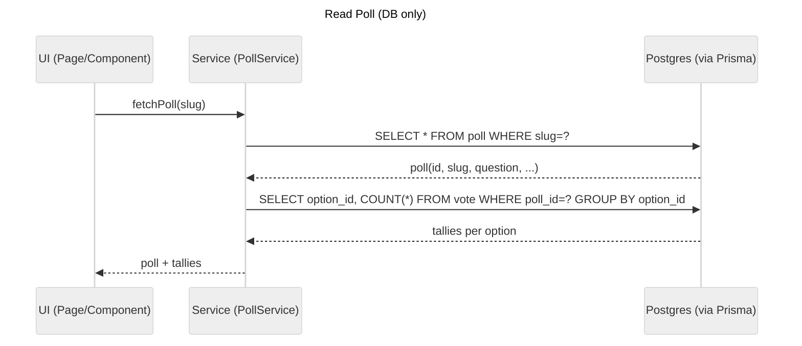
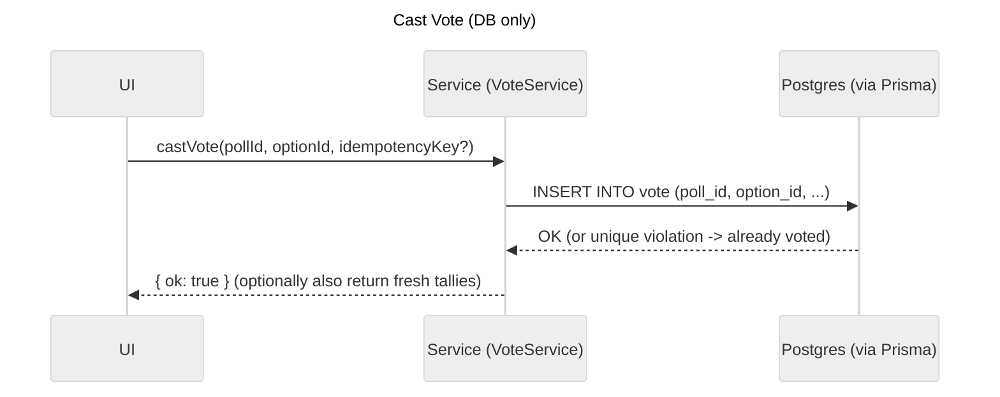

```mermaid
---
title: Read Poll (DB only)
config:
  theme: neutral
---
sequenceDiagram
    participant UI as UI (Page/Component)
    participant S as Service (PollService)
    participant DB as Postgres (via Prisma)

    UI->>S: fetchPoll(slug)
    S->>DB: SELECT * FROM poll WHERE slug=?
    DB-->>S: poll(id, slug, question, ...)
    S->>DB: SELECT option_id, COUNT(*) FROM vote WHERE poll_id=? GROUP BY option_id
    DB-->>S: tallies per option
    S-->>UI: poll + tallies
```

```mermaid
---
title: Cast Vote (DB only)
config:
  theme: neutral
---
sequenceDiagram
    participant UI as UI
    participant VS as Service (VoteService)
    participant DB as Postgres (via Prisma)

    UI->>VS: castVote(pollId, optionId, idempotencyKey?)
    VS->>DB: INSERT INTO vote (poll_id, option_id, ...)
    DB-->>VS: OK (or unique violation -> already voted)
    VS-->>UI: { ok: true } (optionally also return fresh tallies)
```
