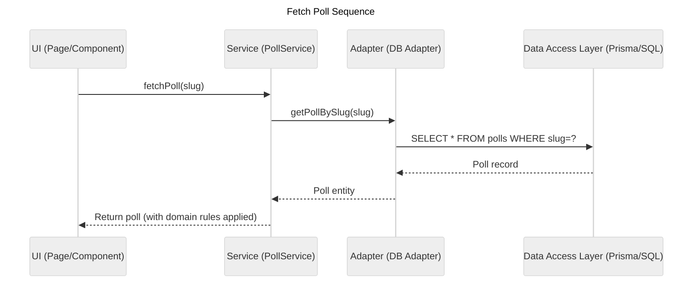

```mermaid
---
title: Fetch Poll Sequence
config:
  theme: neutral
  look: handDrawn
---

sequenceDiagram
    participant UI as UI (Page/Component)
    participant S as Service (PollService)
    participant A as Adapter (DB Adapter)
    participant DAL as Data Access Layer (Prisma/SQL)

    UI->>S: fetchPoll(slug)
    S->>A: getPollBySlug(slug)
    A->>DAL: SELECT * FROM polls WHERE slug=?
    DAL-->>A: Poll record
    A-->>S: Poll entity
    S-->>UI: Return poll (with domain rules applied)
```
