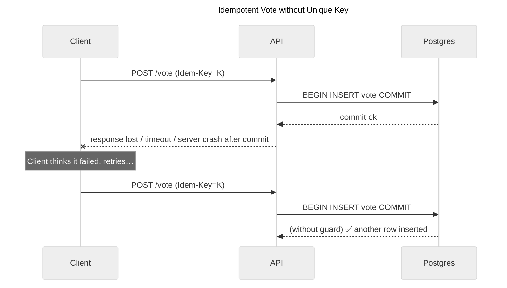
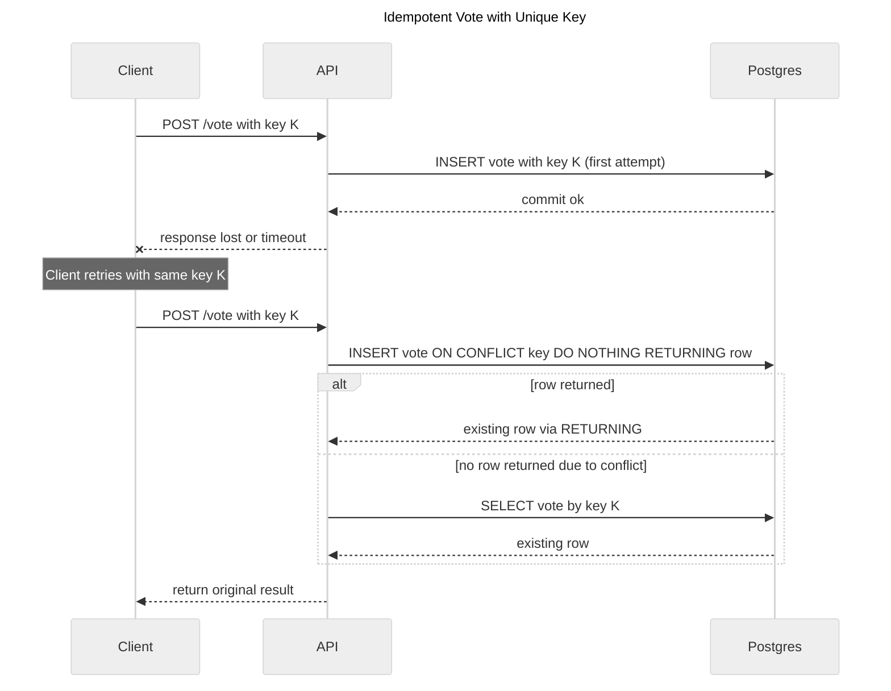

```mermaid
---
title: Idempotent Vote without Unique Key
config:
  theme: neutral
---
sequenceDiagram
  participant C as Client
  participant S as API
  participant DB as Postgres

  C->>S: POST /vote (Idem-Key=K)
  S->>DB: BEGIN INSERT vote COMMIT
  DB-->>S: commit ok
  S--X C: response lost / timeout / server crash after commit

  Note over C: Client thinks it failed, retries…

  C->>S: POST /vote (Idem-Key=K)
  S->>DB: BEGIN INSERT vote COMMIT
  DB-->>S: (without guard) ✅ another row inserted
```

```mermaid
---
title: Idempotent Vote with Unique Key
config:
  theme: neutral
---
sequenceDiagram
  participant C as Client
  participant S as API
  participant DB as Postgres

  C->>S: POST /vote with key K
  S->>DB: INSERT vote with key K (first attempt)
  DB-->>S: commit ok
  S--X C: response lost or timeout

  Note over C: Client retries with same key K

  C->>S: POST /vote with key K
  S->>DB: INSERT vote ON CONFLICT key DO NOTHING RETURNING row
  alt row returned
    DB-->>S: existing row via RETURNING
  else no row returned due to conflict
    S->>DB: SELECT vote by key K
    DB-->>S: existing row
  end
  S-->>C: return original result
```
